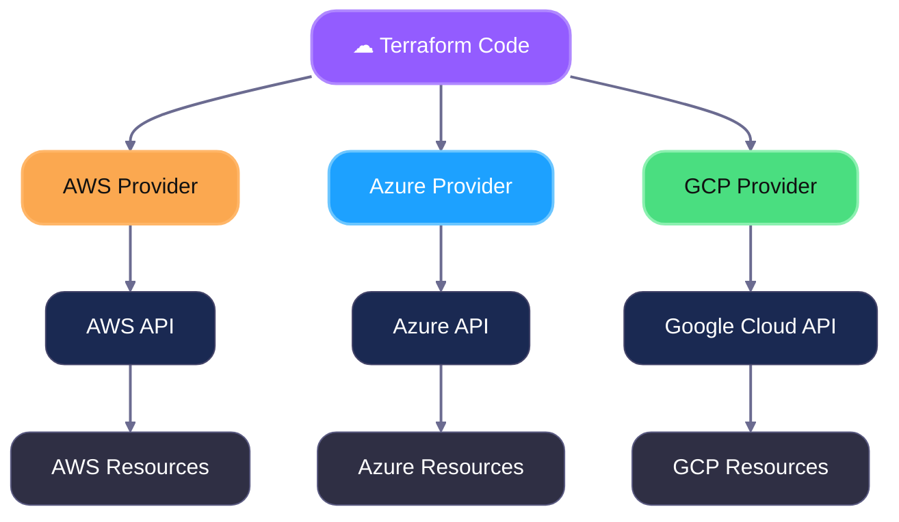

```mermaid
flowchart TB

A["☁ Terraform Code"]

B["AWS Provider"]
C["Azure Provider"]
D["GCP Provider"]

E["AWS API"]
F["Azure API"]
G["Google Cloud API"]

H["AWS Resources"]
I["Azure Resources"]
J["GCP Resources"]

A --> B --> E --> H
A --> C --> F --> I
A --> D --> G --> J

%% Core
style A fill:#935cff,stroke:#b088ff,color:#ffffff,stroke-width:2px,rx:18,ry:18

%% Providers
style B fill:#fba850,stroke:#ffb668,color:#111111,stroke-width:2px,rx:16,ry:16
style C fill:#1da1ff,stroke:#6cc6ff,color:#ffffff,stroke-width:2px,rx:16,ry:16
style D fill:#4ade80,stroke:#8cf0b0,color:#111111,stroke-width:2px,rx:16,ry:16

%% APIs
style E fill:#1a2952,stroke:#45456a,color:#ffffff,rx:14,ry:14
style F fill:#1a2952,stroke:#45456a,color:#ffffff,rx:14,ry:14
style G fill:#1a2952,stroke:#45456a,color:#ffffff,rx:14,ry:14

%% Resources
style H fill:#2f2f44,stroke:#5b5b82,color:#ffffff,rx:14,ry:14
style I fill:#2f2f44,stroke:#5b5b82,color:#ffffff,rx:14,ry:14
style J fill:#2f2f44,stroke:#5b5b82,color:#ffffff,rx:14,ry:14

%% Arrow styling
linkStyle default stroke:#6b6b90,stroke-width:2px
```
