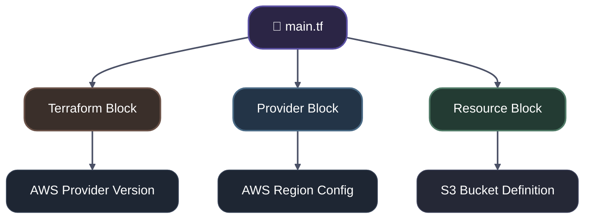

```mermaid
flowchart TB

A["📄 main.tf"]

B["Terraform Block"]
C["Provider Block"]
D["Resource Block"]

E["AWS Provider Version"]
F["AWS Region Config"]
G["S3 Bucket Definition"]

A --> B --> E
A --> C --> F
A --> D --> G

%% Core (deep slate purple)
style A fill:#2b2545,stroke:#5a4fa3,color:#ffffff,stroke-width:2px,rx:18,ry:18

%% Blocks (muted dark tones)
style B fill:#3a2f2a,stroke:#6b5248,color:#ffffff,stroke-width:2px,rx:16,ry:16
style C fill:#233447,stroke:#4a6a85,color:#ffffff,stroke-width:2px,rx:16,ry:16
style D fill:#233b33,stroke:#4f7a66,color:#ffffff,stroke-width:2px,rx:16,ry:16

%% Details (smooth charcoal blues)
style E fill:#1e2633,stroke:#3b465a,color:#ffffff,rx:14,ry:14
style F fill:#1e2633,stroke:#3b465a,color:#ffffff,rx:14,ry:14
style G fill:#252836,stroke:#424760,color:#ffffff,rx:14,ry:14

%% Arrow styling
linkStyle default stroke:#4b5166,stroke-width:2px
```
