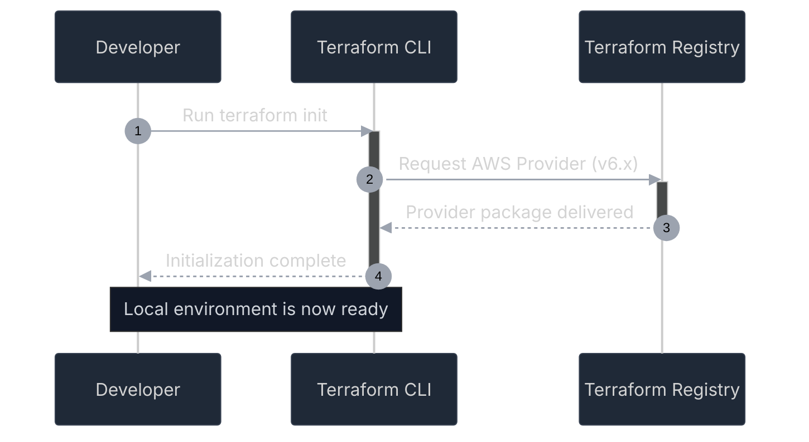

```mermaid
%%{init: {
  "theme": "dark",
  "themeVariables": {
    "lineColor": "#6b7280",
    "signalColor": "#9ca3af",

    "actorBorder": "#374151",
    "actorBkg": "#1f2937",

    "noteBkgColor": "#111827",
    "noteTextColor": "#d1d5db",

    "fontFamily": "Inter, Segoe UI, Arial"
  }
}}%%

sequenceDiagram
    autonumber

    participant Dev as Developer
    participant TF as Terraform CLI
    participant Reg as Terraform Registry

    Dev->>TF: Run terraform init
    activate TF

    TF->>Reg: Request AWS Provider (v6.x)
    activate Reg

    Reg-->>TF: Provider package delivered
    deactivate Reg

    TF-->>Dev: Initialization complete
    deactivate TF

    Note over Dev,TF: Local environment is now ready
```
