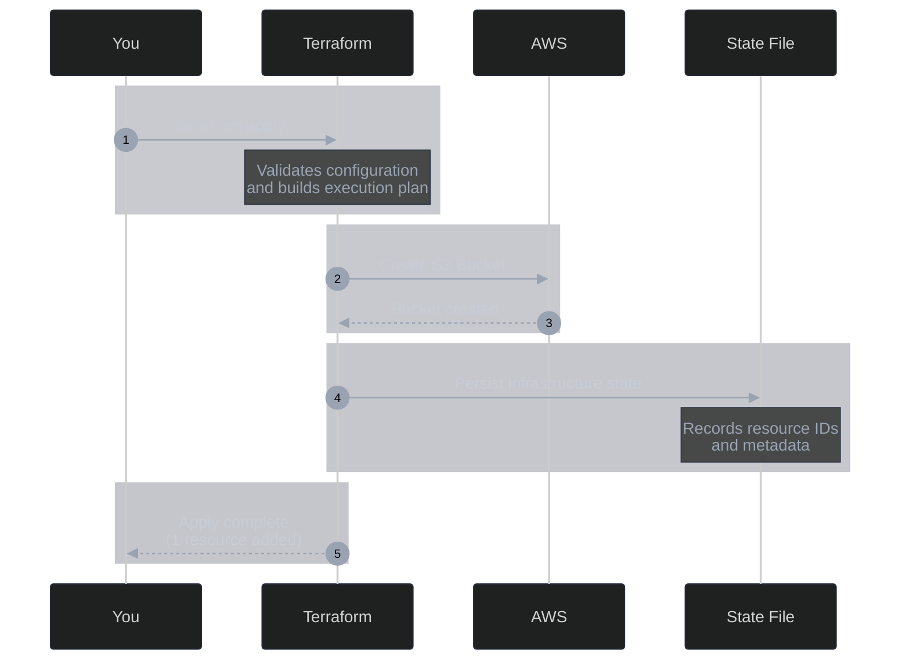

```mermaid
%%{
  init: {
    "theme": "dark",
    "sequence": {
      "showSequenceNumbers": true,
      "actorMargin": 60,
      "messageMargin": 40
    },
    "themeVariables": {
      "background": "#0b0f14",

      "primaryColor": "#1a1f2b",
      "primaryTextColor": "#c7ccd6",
      "primaryBorderColor": "#2a3040",

      "lineColor": "#3a4055",
      "textColor": "#c7ccd6",

      "actorBorder": "#2a3040",
      "actorBackground": "#141824",

      "signalColor": "#9aa3b2",
      "signalTextColor": "#c7ccd6",

      "noteBackgroundColor": "#121622",
      "noteBorderColor": "#2a3040",
      "noteTextColor": "#9aa3b2"
    }
  }
}%%

sequenceDiagram
    autonumber

    participant User as You
    participant TF as Terraform
    participant AWS as AWS
    participant State as State File

    rect rgba(40,45,65,0.25)
        User->>TF: terraform apply
        Note over TF: Validates configuration<br/>and builds execution plan
    end

    rect rgba(35,40,60,0.25)
        TF->>AWS: Create S3 Bucket
        AWS-->>TF: Bucket created
    end

    rect rgba(30,35,55,0.25)
        TF->>State: Persist infrastructure state
        Note over State: Records resource IDs<br/>and metadata
    end

    rect rgba(25,30,50,0.25)
        TF-->>User: Apply complete <br/> (1 resource added)
    end

```
