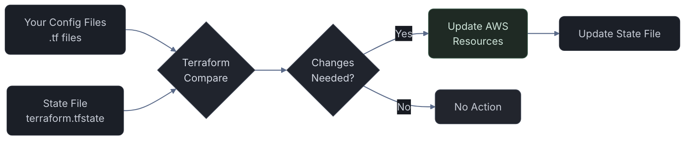

```mermaid
%%{init: {
  "theme": "base",
  "themeVariables": {
    "background": "#0f1115",
    "primaryColor": "#1c1f26",
    "primaryTextColor": "#c7ccd6",
    "primaryBorderColor": "#2a2f3a",

    "secondaryColor": "#181b22",
    "tertiaryColor": "#151820",

    "lineColor": "#5b6b8a",
    "textColor": "#c7ccd6",

    "fontFamily": "Inter, Segoe UI, Arial",

    "clusterBkg": "#141720",
    "clusterBorder": "#2a2f3a"
  }
}}%%

flowchart LR

A["Your Config Files<br/>.tf files"]
C["State File<br/>terraform.tfstate"]

B{"Terraform<br/>Compare"}
D{"Changes<br/>Needed?"}

E["Update AWS<br/>Resources"]
F["No Action"]
G["Update State File"]

A --> B
C --> B
B --> D
D -->|Yes| E
D -->|No| F
E --> G

%% Node styling
style A fill:#1b1f27,stroke:#2a2f3a,color:#c7ccd6,rx:8,ry:8
style C fill:#1b1f27,stroke:#2a2f3a,color:#c7ccd6,rx:8,ry:8

style B fill:#20242d,stroke:#3a4150,color:#d3d8e2,rx:10,ry:10
style D fill:#20242d,stroke:#3a4150,color:#d3d8e2,rx:10,ry:10

style E fill:#1f2a24,stroke:#3a5a4a,color:#cfe5da,rx:8,ry:8
style F fill:#22252d,stroke:#3a4150,color:#c7ccd6,rx:8,ry:8
style G fill:#1b1f27,stroke:#2a2f3a,color:#c7ccd6,rx:8,ry:8

%% Arrow + label styling
linkStyle default stroke:#5b6b8a,stroke-width:1.5px
```
