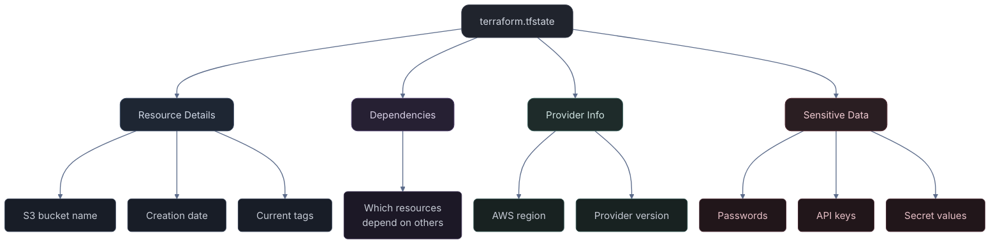

```mermaid
%%{init: {
  "theme": "base",
  "themeVariables": {
    "primaryColor": "#1c1f26",
    "primaryTextColor": "#c7ccd6",
    "primaryBorderColor": "#2a2f3a",
    "lineColor": "#5b6b8a",
    "textColor": "#c7ccd6",
    "fontFamily": "Inter, Segoe UI, Arial"
  },
  "flowchart": {
    "nodeSpacing": 20,
    "rankSpacing": 100
  }
}}%%

flowchart TD

A["terraform.tfstate"]

B["Resource Details"]
C["Dependencies"]
D["Provider Info"]
E["Sensitive Data"]

A --> B
A --> C
A --> D
A --> E

B --> B1["S3 bucket name"]
B --> B2["Creation date"]
B --> B3["Current tags"]

C --> C1["Which resources<br/>depend on others"]

D --> D1["AWS region"]
D --> D2["Provider version"]

E --> E1["Passwords"]
E --> E2["API keys"]
E --> E3["Secret values"]

%% Root
style A fill:#20242d,stroke:#3a4150,color:#d3d8e2,rx:12,ry:12

%% Level 1 — Categories
style B fill:#1e2633,stroke:#3b4b66,color:#d0d8e6,rx:10,ry:10
style C fill:#262033,stroke:#514070,color:#d8d0e6,rx:10,ry:10
style D fill:#1e2b2a,stroke:#3f6661,color:#cfe3e1,rx:10,ry:10
style E fill:#2a1e22,stroke:#5a2e38,color:#f0cbd2,rx:10,ry:10

%% Level 2 — Resource Details (blue shadow)
style B1 fill:#181d27,stroke:#2f3a50,color:#c7ccd6,rx:6,ry:6
style B2 fill:#181d27,stroke:#2f3a50,color:#c7ccd6,rx:6,ry:6
style B3 fill:#181d27,stroke:#2f3a50,color:#c7ccd6,rx:6,ry:6

%% Level 2 — Dependencies (purple shadow)
style C1 fill:#1c1826,stroke:#3a2f50,color:#c7ccd6,rx:6,ry:6

%% Level 2 — Provider Info (teal shadow)
style D1 fill:#182221,stroke:#2f504c,color:#c7ccd6,rx:6,ry:6
style D2 fill:#182221,stroke:#2f504c,color:#c7ccd6,rx:6,ry:6

%% Level 2 — Sensitive (rose shadow)
style E1 fill:#21161a,stroke:#4a2a33,color:#e6bfc6,rx:6,ry:6
style E2 fill:#21161a,stroke:#4a2a33,color:#e6bfc6,rx:6,ry:6
style E3 fill:#21161a,stroke:#4a2a33,color:#e6bfc6,rx:6,ry:6

%% Arrows
linkStyle default stroke:#5b6b8a,stroke-width:1.4px
```
