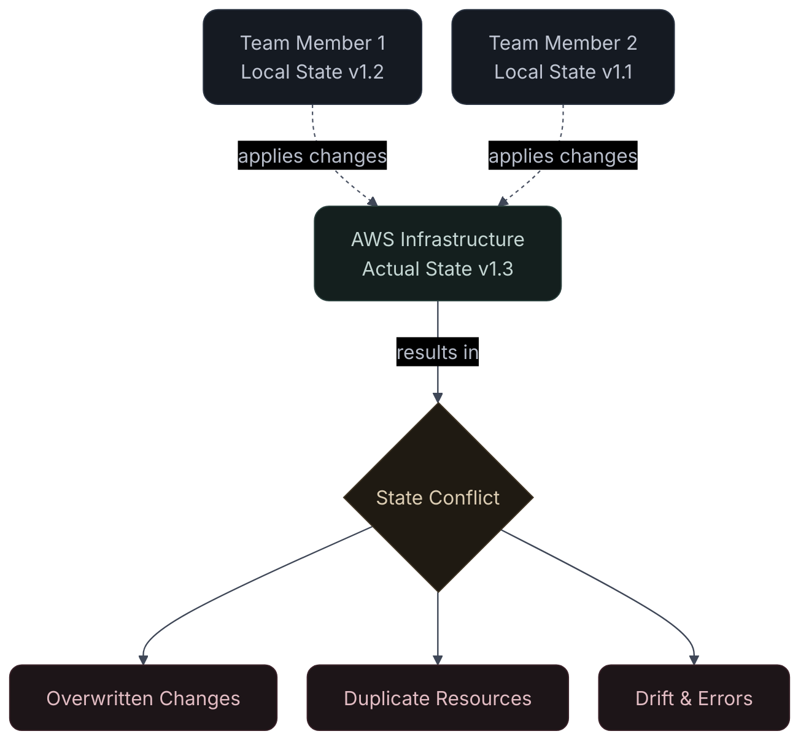

```mermaid
%%{init: {
  "theme": "base",
  "themeVariables": {
    "background": "#000000",
    "primaryColor": "#000000",
    "primaryTextColor": "#b6bcc9",
    "primaryBorderColor": "#242a34",
    "lineColor": "#434c5e",
    "textColor": "#b6bcc9",
    "fontFamily": "Inter, Segoe UI, Arial"
  },
  "flowchart": {
    "nodeSpacing": 25,
    "rankSpacing": 60,
    "curve": "basis"
  }
}}%%

graph TD
    A[Team Member 1<br/>Local State v1.2]
    B[Team Member 2<br/>Local State v1.1]
    C[AWS Infrastructure<br/>Actual State v1.3]
    D{State Conflict}
    E[Overwritten Changes]
    F[Duplicate Resources]
    G[Drift & Errors]

    A -.->|applies changes| C
    B -.->|applies changes| C
    C -->|results in| D
    D --> E
    D --> F
    D --> G

    %% Team members — muted slate blue
    style A fill:#151a22,stroke:#2b3442,color:#c0c6d3,rx:12,ry:12
    style B fill:#151a22,stroke:#2b3442,color:#c0c6d3,rx:12,ry:12

    %% Infrastructure — soft desaturated teal
    style C fill:#141f1e,stroke:#2a3f3c,color:#c4d6d3,rx:12,ry:12

    %% Conflict — muted warm amber
    style D fill:#1f1a12,stroke:#3f3424,color:#dccdb3,rx:12,ry:12

    %% Problems — low-contrast rose
    style E fill:#1d1518,stroke:#3a2229,color:#e2bcc3,rx:10,ry:10
    style F fill:#1d1518,stroke:#3a2229,color:#e2bcc3,rx:10,ry:10
    style G fill:#1d1518,stroke:#3a2229,color:#e2bcc3,rx:10,ry:10

    %% Links — subtle, soft
    linkStyle default stroke:#3f4757,stroke-width:1.2px
    linkStyle 0,1 stroke:#4a5263,stroke-width:1.1px,stroke-dasharray:3

```
