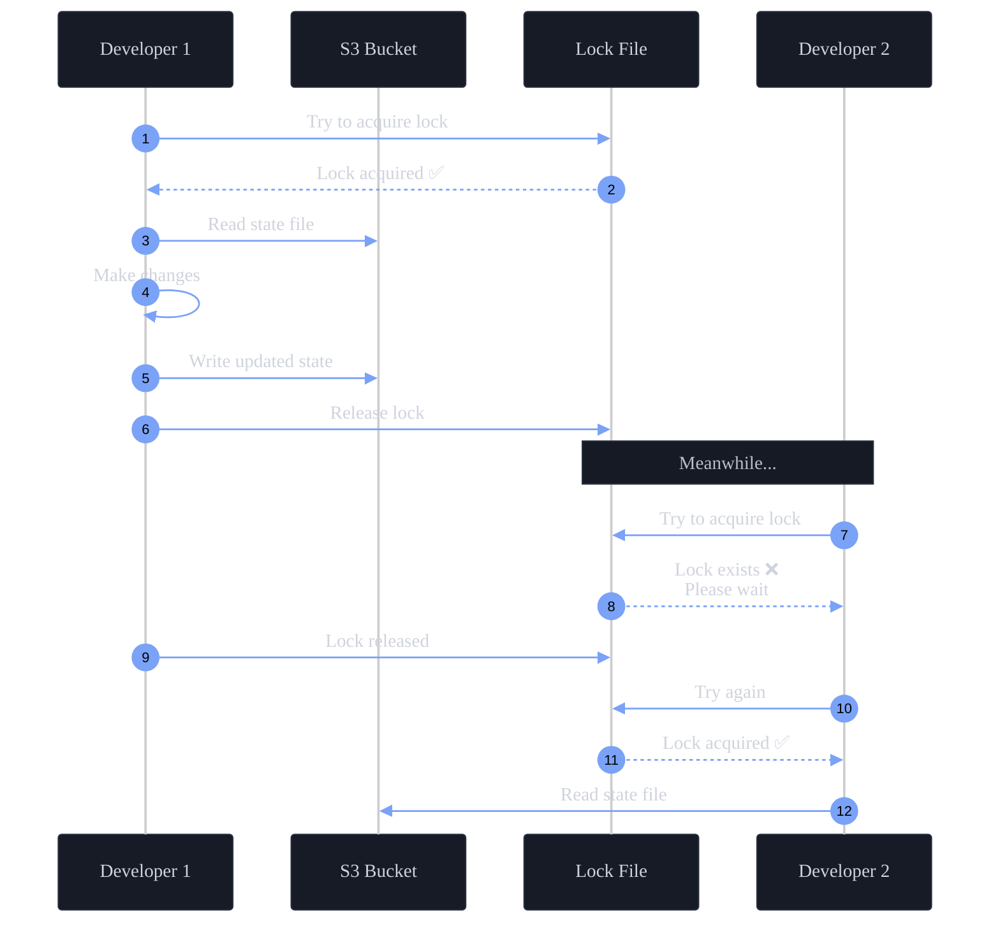

```mermaid
%%{init: {
  "theme": "dark",
  "sequence": {
    "showSequenceNumbers": true
  },
  "themeVariables": {
    "background": "transparent",
    "primaryColor": "#1a1f2b",
    "secondaryColor": "#1a1f2b",
    "tertiaryColor": "#1a1f2b",

    "primaryTextColor": "#cfd3dc",
    "lineColor": "#3a4155",

    "actorBkg": "#161b26",
    "actorBorder": "#2a3142",
    "actorTextColor": "#cfd3dc",

    "noteBkgColor": "#151a24",
    "noteTextColor": "#b8beca",
    "noteBorderColor": "#2a3142",

    "signalColor": "#7aa2f7",
    "signalTextColor": "#cfd3dc",

    "activationBkgColor": "#1f2433",
    "activationBorderColor": "#2a3142",

    "fontFamily": "Inter, ui-sans-serif, system-ui",
    "borderRadius": "10"
  }
}}%%

sequenceDiagram
    autonumber

    participant Dev1 as Developer 1
    participant S3 as S3 Bucket
    participant Lock as Lock File
    participant Dev2 as Developer 2

    Dev1->>Lock: Try to acquire lock
    Lock-->>Dev1: Lock acquired ✅
    Dev1->>S3: Read state file
    Dev1->>Dev1: Make changes
    Dev1->>S3: Write updated state
    Dev1->>Lock: Release lock

    Note over Dev2,Lock: Meanwhile...
    Dev2->>Lock: Try to acquire lock
    Lock-->>Dev2: Lock exists ❌<br/>Please wait

    Dev1->>Lock: Lock released
    Dev2->>Lock: Try again
    Lock-->>Dev2: Lock acquired ✅
    Dev2->>S3: Read state file
```
