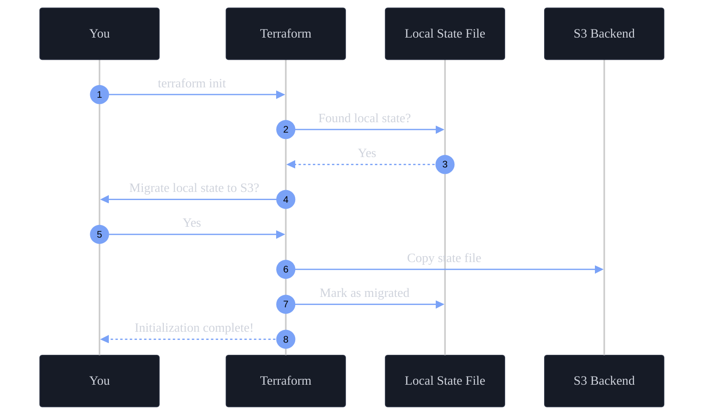

```mermaid
%%{init: {
  "theme": "dark",
  "sequence": {
    "showSequenceNumbers": true
  },
  "themeVariables": {
    "background": "transparent",
    "primaryColor": "#1a1f2b",
    "secondaryColor": "#1a1f2b",
    "tertiaryColor": "#1a1f2b",

    "primaryTextColor": "#cfd3dc",
    "lineColor": "#3a4155",

    "actorBkg": "#161b26",
    "actorBorder": "#2a3142",
    "actorTextColor": "#cfd3dc",

    "noteBkgColor": "#151a24",
    "noteTextColor": "#b8beca",
    "noteBorderColor": "#2a3142",

    "signalColor": "#7aa2f7",
    "signalTextColor": "#cfd3dc",

    "activationBkgColor": "#1f2433",
    "activationBorderColor": "#2a3142",

    "fontFamily": "Inter, ui-sans-serif, system-ui",
    "borderRadius": "10"
  }
}}%%

sequenceDiagram
    participant You
    participant Terraform
    participant Local as Local State File
    participant S3 as S3 Backend

    You->>Terraform: terraform init
    Terraform->>Local: Found local state?
    Local-->>Terraform: Yes
    Terraform->>You: Migrate local state to S3?
    You->>Terraform: Yes
    Terraform->>S3: Copy state file
    Terraform->>Local: Mark as migrated
    Terraform-->>You: Initialization complete!

```
