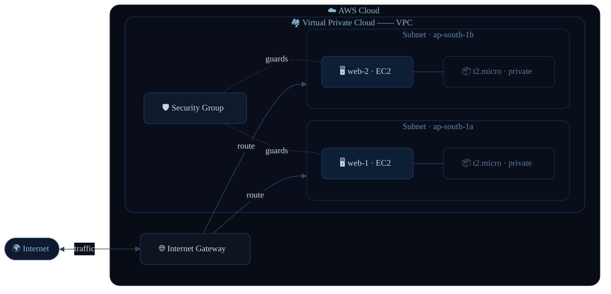

```mermaid
%%{init: {
  "theme": "base",
  "themeVariables": {
    "background": "#080c14",
    "primaryColor": "#0f1520",
    "primaryTextColor": "#c9d5e0",
    "primaryBorderColor": "#1e2d42",
    "lineColor": "#2a4a6b",
    "secondaryColor": "#0a1018",
    "tertiaryColor": "#060a10",
    "clusterBkg": "#0a1220",
    "clusterBorder": "#1a2d45",
    "fontSize": "14px",
    "fontFamily": "ui-monospace, SFMono-Regular, monospace"
  }
}}%%

graph LR

    Internet(["   🌍   Internet   "])

    subgraph AWS["   ☁️   AWS Cloud   "]
        direction TB

        IGW["   🌐   Internet Gateway   "]

        subgraph VPC["   🏘️   Virtual Private Cloud  ——  VPC   "]
            direction LR

            SG["   🛡️   Security Group   "]

            subgraph Subnet1["   📍   Subnet  ·  ap-south-1a   "]
                EC1["   🖥️   web-1  ·  EC2   "]
                INFO1["   📦   t2.micro  ·  private   "]
            end

            subgraph Subnet2["   📍   Subnet  ·  ap-south-1b   "]
                EC2["   🖥️   web-2  ·  EC2   "]
                INFO2["   📦   t2.micro  ·  private   "]
            end
        end
    end

    Internet <-->|"   traffic   "| IGW
    IGW -->|"   route   "| Subnet1
    IGW -->|"   route   "| Subnet2
    SG -.-|"   guards   "| EC1
    SG -.-|"   guards   "| EC2
    EC1 --- INFO1
    EC2 --- INFO2

    style Internet fill:#0f1a2e,stroke:#2a4a6b,color:#7eb8d4,rx:50

    style IGW fill:#0f1520,stroke:#1e3a5f,color:#c9d5e0,rx:8
    style SG fill:#0f1a2e,stroke:#1e3a5f,color:#c9d5e0,rx:8

    style EC1 fill:#0d1f35,stroke:#1e3a5f,color:#c9d5e0,rx:8
    style EC2 fill:#0d1f35,stroke:#1e3a5f,color:#c9d5e0,rx:8

    style INFO1 fill:#080f1a,stroke:#1a2d45,color:#5a7a96,rx:8
    style INFO2 fill:#080f1a,stroke:#1a2d45,color:#5a7a96,rx:8

    style AWS fill:#080c14,stroke:#1e2d42,color:#7eb8d4,rx:16
    style VPC fill:#090e1a,stroke:#1e3255,color:#7eb8d4,rx:14
    style Subnet1 fill:#080f1a,stroke:#1a2d45,color:#5a8aaa,rx:12
    style Subnet2 fill:#080f1a,stroke:#1a2d45,color:#5a8aaa,rx:12
```
