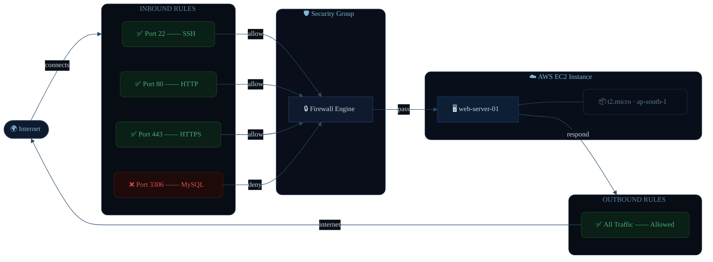

```mermaid
%%{init: {
  "theme": "base",
  "themeVariables": {
    "background": "#080c14",
    "primaryColor": "#0f1520",
    "primaryTextColor": "#c9d5e0",
    "primaryBorderColor": "#1e2d42",
    "lineColor": "#2a4a6b",
    "secondaryColor": "#0a1018",
    "tertiaryColor": "#060a10",
    "clusterBkg": "#0a1220",
    "clusterBorder": "#1a2d45",
    "fontSize": "14px",
    "fontFamily": "ui-monospace, SFMono-Regular, monospace"
  }
}}%%
graph LR

    Internet(["  🌍  Internet  "])

    subgraph INBOUND["INBOUND RULES"]
        direction TB
        R1["  ✅  Port  22   ——  SSH      "]
        R2["  ✅  Port  80   ——  HTTP     "]
        R3["  ✅  Port  443  ——  HTTPS    "]
        R4["  ❌  Port  3306 ——  MySQL    "]
    end

    subgraph FIREWALL["  🛡️  Security Group  "]
        direction TB
        SG["   🔒  Firewall Engine   "]
    end

    subgraph SERVER["  ☁️  AWS EC2 Instance  "]
        direction TB
        EC2["   🖥️  web-server-01   "]
        INFO["   📦  t2.micro  ·  ap-south-1   "]
    end

    subgraph OUTBOUND["OUTBOUND RULES"]
        direction TB
        OUT["  ✅  All Traffic  ——  Allowed  "]
    end

    Internet -->|"  connects  "| INBOUND
    R1 -->|"  allow  "| SG
    R2 -->|"  allow  "| SG
    R3 -->|"  allow  "| SG
    R4 -->|"  deny   "| SG
    SG -->|"  pass   "| EC2
    EC2 --- INFO
    EC2 -->|"  respond  "| OUTBOUND
    OUT -->|"  internet  "| Internet

    style Internet fill:#0f1a2e,stroke:#2a4a6b,color:#7eb8d4,rx:50
    style SG fill:#0f1a2e,stroke:#1e3a5f,color:#c9d5e0
    style EC2 fill:#0d1f35,stroke:#1e3a5f,color:#c9d5e0
    style INFO fill:#080f1a,stroke:#1a2d45,color:#5a7a96,rx:8

    style R1 fill:#0a1f15,stroke:#1a4028,color:#4caf82,rx:8
    style R2 fill:#0a1f15,stroke:#1a4028,color:#4caf82,rx:8
    style R3 fill:#0a1f15,stroke:#1a4028,color:#4caf82,rx:8
    style R4 fill:#1f0a0a,stroke:#401a1a,color:#e05252,rx:8
    style OUT fill:#0a1f15,stroke:#1a4028,color:#4caf82,rx:8

    style INBOUND fill:#080c14,stroke:#1e2d42,color:#5a8aaa,rx:12
    style FIREWALL fill:#090e1a,stroke:#1e3255,color:#7eb8d4,rx:12
    style SERVER fill:#080f1a,stroke:#1a2d45,color:#7eb8d4,rx:12
    style OUTBOUND fill:#080c14,stroke:#1e2d42,color:#5a8aaa,rx:12
```
